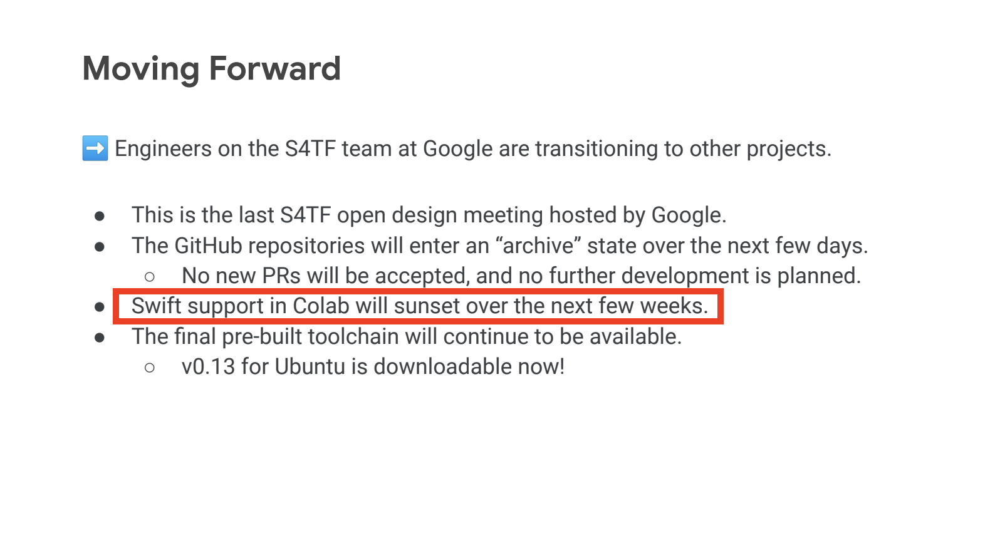

# History of Swift Support in Google Colab

In the last meeting of the original Swift for TensorFlow team (accessed fom the [Open Design Meeting Notes](https://docs.google.com/document/d/1Fm56p5rV1t2Euh6WLtBFKGqI43ozC3EIjReyLk-LCLU/edit)), there was a Google Slides presentation titled ["S4TF History - The [Incomplete] Insider Edition"](https://drive.google.com/file/d/1vxSIRq7KEmrFNAV_E0Wr7Pivn728Wcvs/view). On slide 21, they announced that "Swift support in Colab will sunset over the next few weeks". The presentation was given on February 12, which means support actually ended in March 2021.

The official Swift support came from a built-in Jupyter kernel, cloned from [google/swift-jupyter](https://github.com/google/swift-jupyter). Based on that repository's README, Google may have pre-installed the latest custom S4TF toolchain on their Colab servers, ready to be accessed by the kernel. Once the Jupyter kernel was removed, Colab could not execute notebooks in Swift. Instead, it attempted to run them with the Python kernel.

When Swift [came back](https://forums.swift.org/t/swift-for-tensorflow-resurrection-swift-running-on-colab-again/54158) to Google Colab in January 2022, it used a new Jupyter kernel written in Swift, hosted at [philipturner/swift-colab](https://github.com/philipturner/swift). The kernel downloaded an official Swift toolchain from Apple's servers, instead of an unofficial toolchain created by Google. In addition, the new Swift-Colab compiled itself using the downloaded toolchain. This meant it had to be optimized for JIT compilation.

The initial release of Swift-Colab suffered from an unnecessarily long startup time, caused by JIT compiling Swift code and downloading unnecessary dependencies. In addition, it was a literal translation of the Python code in [google/swift-jupyter](https://github.com/google/swift-jupyter), with very few optimizations or changes to functionality. In April 2022, Swift-Colab was rewritten from scratch using the [philipturner/swift-colab-dev](https://github.com/philipturner/swift-colab-dev) repository.
